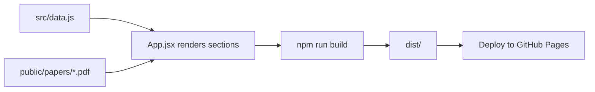

# Update the portfolio in one file

All publications, projects, teaching, summer schools and committees on
[mallouli.com](https://www.mallouli.com/) are rendered from a single source:
[`src/data.js`](src/data.js). Edit that file, run the build, push.

[Quick Start](#quick-start) · [Where to add what](#where-to-add-what) · [Recipes](#recipes) · [FAQ](#faq)

## How content flows



One edit point, one build command, one deploy. No CMS, no database.

## Where to add what

| You want to add a... | Edit this export in `src/data.js` | Notes |
|---|---|---|
| Paper / publication | `PUBLICATIONS` | Group by year. Optionally drop a PDF in `public/papers/` |
| Research project | `PROJECTS` | Group by year |
| Course taught | `TEACHING` | Group by academic year (e.g. `2024–2025`) |
| Summer school | `SUMMER_SCHOOLS` | Flat list, no year grouping |
| Conference committee role | `COMMITTEES` | Group by year, split into `pc` / `organizing` / `reviews` |

Each year-grouped export is an array of `{ year, items: [...] }` objects sorted **newest first**.

## Quick Start

```bash
npm install
```

```bash
npm run dev
```

Open the printed local URL. Edits to `src/data.js` hot-reload instantly.

```bash
npm run build
```

```bash
git add src/data.js public/papers/ dist/
git commit -m "data: add <what you added>"
git push
```

The pre-push hook re-runs `npm run build` to catch syntax errors before they leave your machine.

## Recipes

### Add a new paper

1. **Drop the PDF** (optional) in `public/papers/` using the convention `YYYY-venue-short-title.pdf`:

   ```bash
   cp ~/Downloads/my-paper.pdf public/papers/2026-ares-my-topic.pdf
   ```

2. **Open `src/data.js`** and find the `PUBLICATIONS` block. If the year already exists, add a new object to its `items` array. Otherwise insert a new year block at the top:

   ```js
   {
     year: '2026',
     items: [
       {
         authors: 'First Author, Wissam Mallouli, Other Author',
         title: 'Paper title ending with a period.',
         pdf: '/papers/2026-ares-my-topic.pdf',  // omit if no PDF
         venue: 'ARES 2026, Vienna, Austria. July 2026.',
         doi: 'https://doi.org/10.xxxx/yyyy',    // optional
       },
     ],
   },
   ```

3. **Build and deploy** (see [Quick Start](#quick-start)).

The Publications page will pick up the new year automatically — its filter dropdown is generated from the data.

### Add a new project

Edit `PROJECTS` in `src/data.js`. Find the matching year or insert a new one:

```js
{
  year: '2026',
  items: [
    {
      name: 'PROJECT_ACRONYM',
      program: 'Horizon Europe',                 // optional
      desc: 'One-sentence description ending with a period.',
      dates: '2026-01-01 → 2028-12-31',
    },
  ],
},
```

### Add a course taught

Edit `TEACHING`. Use the academic-year format `YYYY–YYYY` (en-dash, not hyphen):

```js
{
  year: '2025–2026',
  items: [
    { what: 'Course title', where: 'Institution — Programme', meta: 'NN hours' },
  ],
},
```

### Add a summer school

Append to `SUMMER_SCHOOLS` (flat list, newest first):

```js
{ name: 'TAROT 2026', where: 'City, Country · Month DD–DD', role: 'Speaker' },
```

`role` is free-text; existing values include `Speaker`, `Organizer`, `Organizer + Speaker`, `Attendee`.

### Add a committee role

Edit `COMMITTEES`. Each year has up to three buckets — include only the ones that apply:

```js
{
  year: '2026',
  pc: [
    'CONFERENCE 2026 — Full conference name',
  ],
  organizing: ['CONFERENCE 2026'],
  reviews: ['CONFERENCE 2026, OTHER 2026'],
},
```

The About page totals `pc` and `organizing` counts automatically.

## Field reference

<details>
<summary><b>PUBLICATIONS item shape</b></summary>

| Field | Required | Example |
|---|---|---|
| `authors` | yes | `'A. Cavalli, W. Mallouli, ...'` |
| `title` | yes | `'Paper title.'` (end with period) |
| `venue` | yes | `'ARES 2024, Vienna, Austria. July 30 – August 2, 2024.'` |
| `pdf` | no | `'/papers/2024-ares-shennina-pentest.pdf'` (path is web-relative) |
| `doi` | no | `'https://doi.org/10.xxxx/yyyy'` (full URL) |

</details>

<details>
<summary><b>PROJECTS item shape</b></summary>

| Field | Required | Example |
|---|---|---|
| `name` | yes | `'ANASTACIA'` |
| `desc` | yes | `'One-sentence description.'` |
| `dates` | yes | `'2017-01-01 → 2019-12-31'` |
| `program` | no | `'H2020'`, `'Horizon Europe'`, `'FP7'` |

</details>

<details>
<summary><b>TEACHING item shape</b></summary>

| Field | Required | Example |
|---|---|---|
| `what` | yes | `'Java'` |
| `where` | yes | `'ESME Sudria — Master 2 MS'` (use em-dash `—`) |
| `meta` | yes | `'20 hours'` |

</details>

<details>
<summary><b>SUMMER_SCHOOLS item shape</b></summary>

| Field | Required | Example |
|---|---|---|
| `name` | yes | `'TAROT 2017'` |
| `where` | yes | `'Naples, Italy · June 25–30'` (middle-dot `·` separator) |
| `role` | yes | `'Speaker'`, `'Organizer'`, `'Attendee'`, or combinations |

</details>

<details>
<summary><b>COMMITTEES item shape</b></summary>

| Field | Required | Example |
|---|---|---|
| `year` | yes | `'2026'` |
| `pc` | no | array of conference strings |
| `organizing` | no | array of conference names |
| `reviews` | no | array of strings (often comma-joined lists) |

At least one of `pc` / `organizing` / `reviews` must be present.

</details>

## Conventions and gotchas

- **Order matters**: years are rendered in source order. Put the newest year first.
- **Use real Unicode punctuation** — em-dash `—` (not `--`), en-dash `–` (not `-`), middle-dot `·`, arrow `→`. The site already uses these; keep it consistent.
- **PDF paths start with `/`** — `'/papers/foo.pdf'`, not `'papers/foo.pdf'` or `'./papers/foo.pdf'`. The leading slash is required for the Vite base path to resolve.
- **PDF naming convention**: `YYYY-venue-short-title.pdf`, all lowercase, hyphen-separated.
- **Don't put years in `About` totals** — they are computed from the arrays at runtime (`src/App.jsx` lines 88–93).
- **Trailing periods on titles**: existing entries end paper titles with `.` for visual rhythm.

## Deploy

The site deploys from `dist/` to GitHub Pages. After committing data changes:

```bash
npm run build
git add dist/
git commit -m "deploy: rebuild dist with <change>"
git push
```

GitHub Actions also runs `npm run build` on every PR — see [`.github/workflows/ci.yml`](.github/workflows/ci.yml).

## FAQ

**Do I need to touch `App.jsx`?**
No — only when changing how a section is *displayed* (layout, filters, new fields). For pure content updates, `src/data.js` is the only file to edit.

**The build complains about a syntax error in `data.js`.**
Most likely a missing comma between objects, or a stray smart quote. The pre-push `vite-build` hook will catch this before push.

**A new year block doesn't appear on the site.**
Check that the year is a string (`year: '2026'`, not `year: 2026`) and that the new block is inside the export array, not after it.

**Where does the metric "100+ publications, 60+ projects" come from?**
It is computed live from `PUBLICATIONS.length`, `PROJECTS.length`, etc. — never hardcoded. Add a new item and the total updates on next build.

<details>
<summary><b>Original Vite template README</b></summary>

The original `create-vite` boilerplate is preserved at [`README.backup.md`](README.backup.md). It covers React/Vite plugin choices and the React Compiler note — relevant only if you change the build toolchain.

</details>
